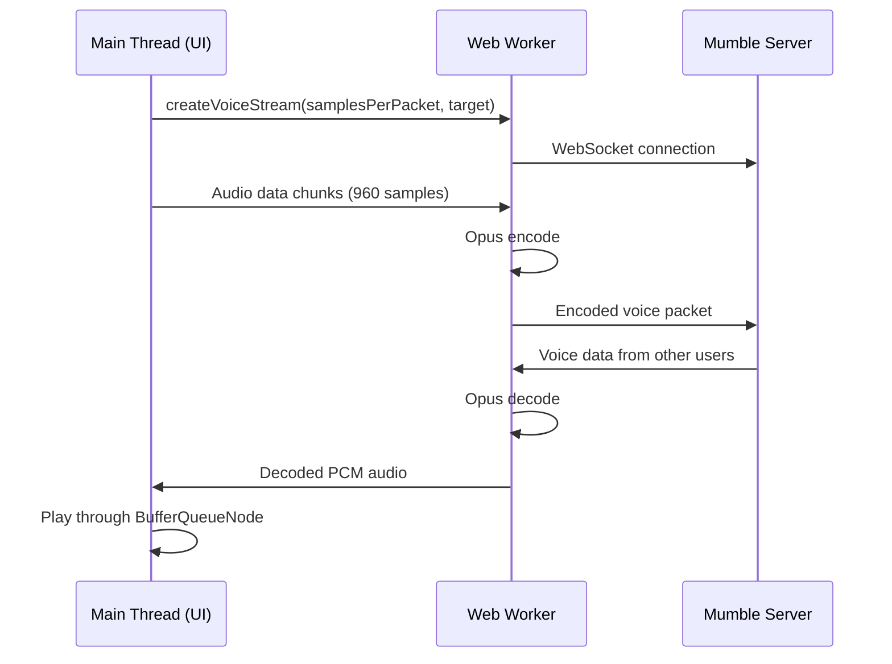

# Technical Debt Analysis - Mumbling Mole
**Analysis Date:** October 10, 2025  
**Repository:** Flexpair/mumbling-mole  
**Branch:** test-loopback-on-3.12.1

---

## Executive Summary

This document identifies technical debt across the Mumbling Mole codebase with prioritized recommendations for remediation. The analysis covers architecture, build systems, code quality, testing, and maintenance concerns.

### Debt Categories by Priority

| Priority | Category | Impact | Effort | Items |
|----------|----------|--------|--------|-------|
| **P0** | Build System Complexity | High | Medium | 6 |
| **P0** | Testing Infrastructure | High | High | 5 |
| **P1** | Architecture & Threading | Medium | High | 7 |
| **P1** | Code Organization | Medium | Medium | 8 |
| **P2** | Documentation Gaps | Low | Low | 4 |
| **P2** | Dependency Management | Medium | Medium | 5 |
| **P3** | Code Quality & Patterns | Low | Low | 6 |

**Total Debt Items:** 41

---

## Priority 0 (Critical) - Address Immediately

### 1. Build System Fragmentation ⚠️

**Problem:**
- Multiple overlapping build mechanisms (`smart-build.sh`, `webpack.config.js`, `prepare` hook, vendor rebuild scripts)
- Manual dependency tracking via `.build-marker` files and timestamp checks
- Fragile incremental build logic that can fall out of sync
- Vendor dependencies (`mumble-client`) require manual babel transpilation before use

**Impact:** 
- High risk of build artifacts being out of sync with source
- New developers face steep learning curve
- CI/CD pipelines are brittle and hard to debug
- Build failures are cryptic (e.g., checking if `dist/index.html` > 1KB)

**Evidence:**
```bash
# smart-build.sh has complex decision tree
if [[ ! -f dist/.build-marker ]]; then
  log "No build marker → rebuilding"
  do_build
  exit 0
fi

# Manual vendor rebuild required
if [[ ! -s vendors/mumble-client/lib/client.js ]]; then
  node scripts/build-mumble-client.js
fi
```

**Recommendation (Effort: Medium, Impact: High):**
1. **Consolidate into webpack.resolve.alias** for vendor dependencies instead of pre-transpiling
2. **Remove smart-build.sh** in favor of pure webpack with proper file watching
3. **Use webpack-dev-server** or Vite for development (hot reload, better DX)
4. **Add build verification tests** that check bundle integrity programmatically
5. **Document build process** in a dedicated `docs/BUILD_ARCHITECTURE.md`

**Migration Path:**
```javascript
// webpack.config.js enhancement
resolve: {
  alias: {
    'mumble-client': path.resolve(__dirname, 'vendors/mumble-client/src'),
    // Let babel-loader handle transpilation
  }
}
```

---

### 2. Lack of Unit Tests ⚠️

**Problem:**
- **Zero unit tests** for application code (only integration/E2E tests exist)
- No test coverage for critical components:
  - `audio-context-manager.js` (352 lines, complex state machine)
  - `worker-client.js` (410 lines, proxy pattern + user migration)
  - `voice.js` (249 lines, AudioWorklet integration)
  - `GlobalBindings` class (1474 lines in index.js, massive god object)
- Loopback testing relies on live server interaction
- No mocking infrastructure for Web Audio API, Workers, or AudioWorklet

**Impact:**
- Regressions go undetected until E2E tests run (slow feedback loop)
- Refactoring is risky without safety net
- Audio bugs are caught in production or manual testing
- Worker thread bugs require full build + server to test

**Evidence:**
```bash
$ find . -name "*.test.js" -o -name "*.spec.js" | grep -v vendors
# Returns 0 application test files (only vendor tests exist)
```

**Recommendation (Effort: High, Impact: High):**
1. **Add Jest + jsdom** for unit testing framework
2. **Create test doubles** for Web Audio API (`AudioContext`, `AudioWorkletNode`, `MediaStream`)
3. **Extract testable logic** from monolithic classes
4. **Target 60% code coverage** for critical paths:
   - Audio context lifecycle
   - Worker message passing
   - Voice handler state transitions
   - User/channel proxy creation
5. **Run unit tests in CI** before E2E tests

**Example Test Structure:**
```javascript
// tests/unit/audio-context-manager.test.js
import AudioContextManager from '../../app/audio-context-manager';

describe('AudioContextManager', () => {
  it('should handle user interaction before resuming', async () => {
    const manager = new AudioContextManager();
    expect(manager.userInteractionDetected).toBe(false);
    // Mock user click event
    manager.handleUserInteraction();
    expect(manager.userInteractionDetected).toBe(true);
  });
});
```

---

### 3. Vendored Dependencies Without Upstream Sync Strategy ⚠️

**Problem:**
- Three vendored dependencies (`mumble-client`, `netlify-identity-widget`, `web-audio-buffer-queue`) are "file:" protocol deps
- No documented process for upstream updates or security patches
- `mumble-client` is a fork with custom babel transpilation step
- Risk of missing critical security updates in vendored code

**Impact:**
- Security vulnerabilities may persist in vendored code
- Difficult to track which upstream version we're based on
- Manual merge conflicts when attempting to sync with upstream
- No automated dependency vulnerability scanning for vendored code

**Evidence:**
```json
// package.json
"mumble-client": "file:vendors/mumble-client",
"netlify-identity-widget": "file:vendors/netlify-identity-widget",
"web-audio-buffer-queue": "file:vendors/web-audio-buffer-queue"
```

**Recommendation (Effort: Medium, Impact: High):**
1. ✅ **COMPLETED:** Document fork reasons in `vendors/*/FORK_RATIONALE.md` for each vendored dep
2. **Add upstream git remotes** to vendor subdirectories
3. **Create quarterly sync schedule** for reviewing upstream changes
4. **Migrate to npm/GitHub packages** where possible (especially `web-audio-buffer-queue`)
5. **Add Dependabot** or Renovate config for vendored dependencies
6. ✅ **COMPLETED:** Document custom patches in vendor README files

**Documentation Created:**
- ✅ `vendors/README.md` - Overview of all vendored dependencies
- ✅ `vendors/mumble-client/FORK_RATIONALE.md` - Babel 7 upgrade, formatting changes
- ✅ `vendors/mumble-streams/FORK_RATIONALE.md` - **Critical:** ProtobufJS v5→v7 security fork
- ✅ `vendors/web-audio-buffer-queue/FORK_RATIONALE.md` - Polyfill removal, refactoring
- ✅ `vendors/netlify-identity-widget/VENDOR_STATUS.md` - Unmodified upstream copy

**Key Findings:**
- **mumble-streams** uses ProtobufJS v7 (upstream still on vulnerable v5) - **DO NOT sync blindly**
- All forks are functionally compatible with upstream
- Quarterly review schedule documented in `vendors/README.md`

---

### 4. Monolithic GlobalBindings Class (God Object) ⚠️

**Problem:**
- `GlobalBindings` class in `app/index.js` is **1474 lines** and manages:
  - Connection lifecycle
  - Audio context management
  - Microphone permissions
  - User settings persistence
  - Guacamole frame integration
  - Netlify Identity auth
  - Loopback testing mode
  - Modal state management
- Violates Single Responsibility Principle
- Impossible to unit test without full integration environment

**Impact:**
- Changes in one feature risk breaking unrelated features
- Cannot test audio logic without auth logic
- Knockout.js observables are tightly coupled
- New features bloat the class further
- Onboarding developers struggle to understand responsibility boundaries

**Evidence:**
```javascript
// app/index.js - 50+ properties in constructor
class GlobalBindings {
  constructor(config) {
    this.config = config;
    this.settings = new Settings(config.settings);
    this.connector = new WorkerBasedMumbleConnector();
    this.client = null;
    this.micPermissionDenied = ko.observable(false);
    this.netlifyIdentity = window.netlifyIdentity;
    this.connectDialog = new ConnectDialog();
    this.sampleRateWarningDialog = new SampleRateWarningDialog(this);
    this.guacamoleFrame = new GuacamoleFrame();
    this.connectionInfo = new ConnectionInfo(this);
    // ... 40+ more properties
  }
}
```

**Recommendation (Effort: High, Impact: High):**
1. **Extract domain services** from GlobalBindings:
   - `AudioManager` (context, permissions, loopback)
   - `ConnectionManager` (connect, disconnect, reconnect)
   - `AuthenticationService` (Netlify Identity integration)
   - `SettingsService` (localStorage persistence)
   - `ModalStateManager` (dialog coordination)
2. **Use dependency injection** to wire services together
3. **Maintain UI bindings** in GlobalBindings, but delegate to services
4. **Migrate incrementally** - extract one service at a time
5. **Add unit tests** for each extracted service

**Example Refactoring:**
```javascript
// app/services/audio-manager.js
export class AudioManager {
  constructor(audioContextManager) {
    this.audioContextManager = audioContextManager;
    this.micPermissionDenied = ko.observable(false);
    this.audioLockActive = ko.observable(false);
  }
  
  async requestMicPermission() { /* ... */ }
  activateAudioLock(reason) { /* ... */ }
}

// app/index.js
class GlobalBindings {
  constructor(config) {
    this.audioManager = new AudioManager(audioContextManager);
    // Expose observables for UI bindings
    this.micPermissionDenied = this.audioManager.micPermissionDenied;
  }
}
```

---

### 5. No Integration Test Coverage for Worker Threading ⚠️

**Problem:**
- Worker message passing relies on manual serialization/deserialization
- No automated tests for race conditions between main thread and worker
- User object migration (`_users[undefined]` → `_users[actualID]`) is undocumented and brittle
- Event dispatching between threads uses string-based message types (prone to typos)

**Impact:**
- Worker crashes manifest as silent failures in production
- Race conditions in voice stream initialization cause intermittent audio bugs
- Refactoring worker protocol is risky without tests

**Evidence:**
```javascript
// app/worker-client.js - Complex user migration logic with no tests
_setProp(prop, value) {
  // USER-MIGRATION: Handle server assigning our real user ID
  if (prop === 'self' && value !== undefined) {
    // Migrate from undefined to actual ID
    let tempUser = this._users[undefined];
    if (tempUser) {
      this._users[value] = tempUser;
      delete this._users[undefined];
    }
  }
  // ... more migration logic
}
```

**Recommendation (Effort: Medium, Impact: High):**
1. **Add worker integration tests** using Jest's worker support
2. **Test message round-trips** for all worker RPC methods
3. **Simulate race conditions** (e.g., voice data before user ID assigned)
4. **Add schema validation** for worker messages (e.g., using Zod or JSON Schema)
5. **Generate types** from message schemas for TypeScript migration later

**Example Test:**
```javascript
// tests/integration/worker-protocol.test.js
describe('Worker Protocol', () => {
  it('should handle user migration from undefined to actual ID', async () => {
    const connector = new WorkerBasedMumbleConnector();
    const client = await connector.connect('test:64738', {});
    
    // Simulate server assigning user ID
    const user = client._user(undefined);
    user._setProp('name', 'TestUser');
    user._setProp('self', 42);
    
    // User should migrate to ID 42
    expect(client._users[42]).toBeDefined();
    expect(client._users[42].name).toBe('TestUser');
    expect(client._users[undefined]).toBeUndefined();
  });
});
```

---

### 6. Missing Error Boundaries and Recovery Strategies ⚠️

**Problem:**
- AudioContext creation failures have fallback, but most audio errors are logged and ignored
- Worker crashes don't trigger reconnection or user notification
- Network failures during voice streaming fail silently
- No circuit breaker pattern for repeated connection failures

**Impact:**
- Users experience broken audio without clear error messages
- Developers debug production issues from incomplete logs
- No graceful degradation when features fail

**Evidence:**
```javascript
// app/voice.js - Errors logged but not propagated
try {
  this._getOrCreateOutbound().write(data, callback);
} catch (err) {
  console.error("[VOICE-HANDLER] Error in _getOrCreateOutbound:", err);
  callback(err); // Error passed to callback but no UI notification
}
```

**Recommendation (Effort: Medium, Impact: High):**
1. **Implement error boundary pattern** for critical subsystems
2. **Add user-facing error notifications** for recoverable failures
3. **Implement retry logic** with exponential backoff for transient failures
4. **Add telemetry/monitoring hooks** for error tracking (optional Sentry integration)
5. **Create error recovery playbook** in documentation

**Example Error Boundary:**
```javascript
// app/services/error-boundary.js
export class AudioErrorBoundary {
  constructor(notificationService) {
    this.notificationService = notificationService;
    this.retryCount = 0;
    this.maxRetries = 3;
  }
  
  async executeWithRetry(fn, errorMessage) {
    for (let i = 0; i < this.maxRetries; i++) {
      try {
        return await fn();
      } catch (error) {
        if (i === this.maxRetries - 1) {
          this.notificationService.showError(errorMessage, error);
          throw error;
        }
        await this.delay(Math.pow(2, i) * 1000);
      }
    }
  }
}
```

---

## Priority 1 (High) - Address Within Quarter

### 7. Worker Communication Protocol Lacks Type Safety

**Problem:**
- Worker messages use plain objects with string-based `method` and `event` properties
- No TypeScript or runtime validation of message shapes
- Easy to introduce breaking changes by renaming properties

**Impact:**
- Runtime errors from typos in message properties
- Difficult to refactor worker protocol
- No IDE autocomplete for worker methods

**Recommendation (Effort: Medium, Impact: Medium):**
1. **Define message schemas** using JSDoc or migrate to TypeScript
2. **Add runtime validation** using Zod or similar library
3. **Generate TypeScript definitions** from schemas
4. **Create worker protocol documentation** in `docs/WORKER_PROTOCOL.md`

**Example Schema:**
```javascript
/**
 * @typedef {Object} WorkerMessage
 * @property {number} clientId
 * @property {number} [channelId]
 * @property {number} [userId]
 * @property {string} method
 * @property {number} reqId
 * @property {any} payload
 */
```

---

### 8. Audio Context Manager Has Hidden State Machine

**Problem:**
- `AudioContextManager` class manages complex lifecycle (created → suspended → running → closed)
- State transitions happen through event listeners and callbacks
- No explicit state machine implementation
- Resume logic uses retry counter but no clear timeout/failure state

**Impact:**
- Difficult to reason about valid state transitions
- Race conditions between resume attempts and state changes
- No way to visualize current state for debugging

**Recommendation (Effort: Medium, Impact: Medium):**
1. **Implement explicit state machine** using XState or custom FSM
2. **Define all valid state transitions** explicitly
3. **Add state transition logging** for debugging
4. **Expose state machine for testing**

**Example State Machine:**
```javascript
import { createMachine, interpret } from 'xstate';

const audioContextMachine = createMachine({
  id: 'audioContext',
  initial: 'uninitialized',
  states: {
    uninitialized: {
      on: { INIT: 'creating' }
    },
    creating: {
      on: { 
        SUCCESS: 'suspended',
        FAILURE: 'failed'
      }
    },
    suspended: {
      on: { RESUME: 'resuming', CLOSE: 'closed' }
    },
    resuming: {
      on: {
        SUCCESS: 'running',
        FAILURE: 'suspended'
      }
    },
    running: {
      on: { SUSPEND: 'suspended', CLOSE: 'closed' }
    },
    closed: {},
    failed: {}
  }
});
```

---

### 9. Inconsistent Error Handling Patterns

**Problem:**
- Mix of `try/catch`, `.catch()` promises, and callback error handling
- Some errors logged to console, others thrown
- No consistent error classification (transient vs permanent)

**Impact:**
- Hard to track error flows through the codebase
- Inconsistent user experience when errors occur
- Difficult to add centralized error monitoring

**Recommendation (Effort: Low, Impact: Medium):**
1. **Standardize on async/await** with try/catch for new code
2. **Create error classification system** (NetworkError, AudioError, AuthError, etc.)
3. **Implement centralized error handler**
4. **Add error codes** for programmatic handling

**Example Error Classification:**
```javascript
// app/errors/error-types.js
export class MumbleError extends Error {
  constructor(message, code, recoverable = false) {
    super(message);
    this.code = code;
    this.recoverable = recoverable;
  }
}

export class AudioInitError extends MumbleError {
  constructor(message) {
    super(message, 'AUDIO_INIT_FAILED', true);
  }
}
```

---

### 10. Settings Persistence Directly Uses localStorage

**Problem:**
- Settings class directly reads/writes to `localStorage` in constructor and `save()` method
- No abstraction layer for storage (hard to test, hard to migrate to IndexedDB/server-side)
- No error handling for quota exceeded or privacy mode
- Settings stored with `"mumble."` prefix but no versioning

**Impact:**
- Cannot unit test settings without mocking global `localStorage`
- Cannot migrate to different storage backend without refactoring
- Risk of data corruption if localStorage is full or disabled

**Recommendation (Effort: Low, Impact: Medium):**
1. **Create storage abstraction** (`StorageService` interface)
2. **Add error handling** for storage quota exceeded
3. **Version settings schema** to support migrations
4. **Implement settings validation** on load

**Example Abstraction:**
```javascript
// app/services/storage-service.js
export class LocalStorageService {
  constructor(prefix = 'mumble', version = 1) {
    this.prefix = prefix;
    this.version = version;
  }
  
  get(key, defaultValue = null) {
    try {
      const item = localStorage.getItem(`${this.prefix}.${key}`);
      return item ? JSON.parse(item) : defaultValue;
    } catch (error) {
      console.error('Storage read error:', error);
      return defaultValue;
    }
  }
  
  set(key, value) {
    try {
      localStorage.setItem(`${this.prefix}.${key}`, JSON.stringify(value));
      return true;
    } catch (error) {
      if (error.name === 'QuotaExceededError') {
        // Handle quota exceeded
      }
      return false;
    }
  }
}
```

---

### 11. Decoder/Encoder Worker Pools Lack Resource Management

**Problem:**
- Worker pools (`decoder-stream.js`, `encoder-stream.js`) use `reuse-pool` but no max pool size
- No worker health checks or automatic recreation on failure
- First worker is kept "warm" but no monitoring if it crashes
- No metrics on pool utilization

**Impact:**
- Memory leaks if workers are not properly recycled
- Performance degradation if workers crash and aren't replaced
- Difficult to diagnose worker pool issues in production

**Recommendation (Effort: Medium, Impact: Medium):**
1. **Add max pool size configuration**
2. **Implement worker health checks** (ping/pong messages)
3. **Add pool metrics** (active workers, queue depth, recycle rate)
4. **Implement worker timeout** for stuck workers
5. **Add worker crash recovery**

**Example Health Check:**
```javascript
class ManagedWorkerPool {
  constructor(createWorker, maxSize = 4) {
    this.pool = createPool(createWorker);
    this.maxSize = maxSize;
    this.healthCheckInterval = setInterval(() => this.checkHealth(), 10000);
  }
  
  async checkHealth() {
    // Send ping to all active workers
    // Recreate workers that don't respond within timeout
  }
}
```

---

### 12. Guacamole Integration is Tightly Coupled

**Problem:**
- `GuacamoleFrame` class is embedded in main UI controller
- localStorage sanitization for Guacamole is in main index.js
- No clear interface between Mumble client and Guacamole iframe
- Auth credentials stored in `_guacLogin`/`_guacPassword` without encryption

**Impact:**
- Cannot disable Guacamole integration without modifying core code
- Credentials stored in memory without protection
- Difficult to test Mumble features without Guacamole infrastructure

**Recommendation (Effort: Medium, Impact: Low):**
1. **Extract Guacamole integration** into separate module
2. **Define clear integration interface**
3. **Make Guacamole optional** via feature flag
4. **Implement secure credential storage** (encrypt in memory, clear after use)

---

### 13. No Centralized Logging Infrastructure

**Problem:**
- Console.log statements scattered throughout codebase (50+ locations)
- Inconsistent log prefixes (`[VOICE]`, `[DEBUG-WORKER]`, `[AudioContext]`)
- No log levels (debug, info, warn, error)
- Production builds still include verbose logging

**Impact:**
- Difficult to filter logs by component in production
- Cannot disable debug logs in production builds
- No structured logging for production debugging

**Recommendation (Effort: Low, Impact: Medium):**
1. **Implement logging service** with levels
2. **Add log filtering** by component
3. **Strip debug logs** in production builds (webpack DefinePlugin)
4. **Add structured logging** option for production monitoring

**Example Logger:**
```javascript
// app/services/logger.js
class Logger {
  constructor(component, level = 'info') {
    this.component = component;
    this.level = level;
  }
  
  debug(...args) {
    if (this.shouldLog('debug')) {
      console.log(`[${this.component}][DEBUG]`, ...args);
    }
  }
  
  info(...args) { /* ... */ }
  warn(...args) { /* ... */ }
  error(...args) { /* ... */ }
  
  shouldLog(level) {
    const levels = ['debug', 'info', 'warn', 'error'];
    return levels.indexOf(level) >= levels.indexOf(this.level);
  }
}

// Usage
const logger = new Logger('AudioContext', process.env.LOG_LEVEL);
logger.debug('State changed to:', state);
```

---

## Priority 2 (Medium) - Address Within 6 Months

### 14. Build Output Validation is Brittle

**Problem:**
- Build validation checks if `dist/index.html` is larger than 1KB
- No validation of JavaScript bundle integrity
- No checks for missing assets or broken references
- Build can succeed with broken code if it compiles

**Impact:**
- Silent failures in production if assets are corrupted
- No early detection of missing dependencies

**Recommendation (Effort: Low, Impact: Low):**
1. **Add checksum validation** for critical assets
2. **Implement smoke test** that loads dist/index.html in headless browser
3. **Validate all asset references** in HTML
4. **Add bundle size budgets** to catch bloat

---

### 15. Configuration Management is Scattered

**Problem:**
- Default config in `app/config.js`
- Local overrides in `dist/config.local.js` (generated, backed up manually)
- Environment variables for dev server (`MUMBLE_SERVER`, `PORT`, `SKIP_TUNNEL`)
- Query parameters for theme selection
- No centralized config precedence documentation

**Impact:**
- Difficult to understand configuration hierarchy
- Easy to lose local config during rebuilds
- No validation of configuration values

**Recommendation (Effort: Low, Impact: Low):**
1. **Centralize config resolution** in single module
2. **Document precedence order** clearly
3. **Add config validation** on load
4. **Use .env files** for local development config
5. **Generate TypeScript types** for config schema

**Example Config Hierarchy:**
```javascript
// app/config/index.js
const configSources = [
  loadFromQueryParams(),
  loadFromLocalFile(),
  loadFromEnv(),
  loadDefaults()
];

const config = merge(...configSources);
validateConfig(config);
```

---

### 16. Voice Handler Loopback Mode Uses Magic Number

**Problem:**
- Loopback mode uses `target=31` as magic number for server echo
- No constant definition or documentation of what 31 means
- Loopback mode flag stored in `isLoopbackMode` observable but not persisted

**Impact:**
- Code is not self-documenting
- Risk of breaking loopback if magic number changes
- Users lose loopback state on page reload

**Recommendation (Effort: Low, Impact: Low):**
1. **Define constants** for voice targets
2. **Document Mumble protocol** target meanings
3. **Consider persisting** loopback mode in settings

**Example Constants:**
```javascript
// app/constants/voice-targets.js
export const VoiceTarget = {
  NORMAL: 0,          // Current channel
  WHISPER: 1,         // Direct whisper
  SERVER_LOOPBACK: 31 // Server echo for testing
};
```

---

### 17. No Performance Monitoring

**Problem:**
- No metrics collected for audio latency, packet loss, or encoding performance
- No visibility into worker thread performance
- Cannot diagnose performance regressions without manual profiling

**Impact:**
- Performance issues discovered by users, not developers
- No baseline metrics for optimization efforts

**Recommendation (Effort: Medium, Impact: Low):**
1. **Add performance metrics collection** (Web Performance API)
2. **Track audio-specific metrics** (encode time, decode time, buffer underruns)
3. **Implement performance dashboard** (optional)
4. **Add performance regression tests**

---

### 18. Documentation Lacks Diagrams

**Problem:**
- Complex threading model not visualized
- Audio pipeline flow not documented visually
- Worker message protocol only described in code comments

**Impact:**
- Steep learning curve for new developers
- Difficult to understand system architecture without reading all code

**Recommendation (Effort: Low, Impact: Low):**
1. **Create architecture diagrams** (Mermaid or PlantUML)
2. **Document audio pipeline** with sequence diagrams
3. **Visualize worker protocol** with state diagrams
4. **Add diagrams to copilot instructions**

**Example Diagram:**


---

### 19. Netlify Identity Integration is Hardcoded

**Problem:**
- Assumes `window.netlifyIdentity` global exists
- Fallback mock is basic and untested
- Auth integration cannot be swapped for other providers

**Impact:**
- Locked into Netlify Identity provider
- Cannot test auth flows without Netlify infrastructure
- Difficult to support alternative auth methods

**Recommendation (Effort: Medium, Impact: Low):**
1. **Create auth abstraction layer** (`AuthProvider` interface)
2. **Implement Netlify Identity adapter**
3. **Support alternative auth** (OAuth, JWT, etc.)
4. **Make auth optional** for self-hosted deployments

---

### 20. Sample Rate Warning Modal Blocks Connection Flow

**Problem:**
- Sample rate validation requires user interaction before connecting
- Modal can block automated testing
- No way to bypass for advanced users who understand the implications

**Impact:**
- Slower connection flow for users
- Automated tests need special handling
- Power users annoyed by extra click

**Recommendation (Effort: Low, Impact: Low):**
1. **Add "Don't show again" checkbox** with localStorage persistence
2. **Allow bypass via query parameter** for testing
3. **Implement warning banner** instead of blocking modal for non-critical cases

---

### 21. Dependency Versions Use Wide Ranges

**Problem:**
- Some dependencies use `^` or `~` version ranges
- No automated dependency updates (Dependabot/Renovate)
- `package-lock.json` provides reproducibility but upstream security patches delayed

**Impact:**
- Security vulnerabilities may persist longer than necessary
- Breaking changes from minor version bumps possible
- Manual effort required to stay up to date

**Recommendation (Effort: Low, Impact: Medium):**
1. **Add Renovate or Dependabot** configuration
2. **Group dependency updates** by category
3. **Automate security patch PRs**
4. **Pin critical dependencies** to exact versions

**Example Renovate Config:**
```json
{
  "extends": ["config:base"],
  "packageRules": [
    {
      "matchPackagePatterns": ["*"],
      "matchUpdateTypes": ["minor", "patch"],
      "groupName": "all non-major dependencies",
      "groupSlug": "all-minor-patch"
    }
  ]
}
```

---

## Priority 3 (Low) - Address as Opportunities Arise

### 22. Knockout.js is Legacy Framework

**Problem:**
- Knockout.js 3.5.1 (last major update 2019)
- Modern alternatives (React, Vue, Svelte) have better ecosystems
- Two-way binding can cause performance issues with large state trees

**Impact:**
- Harder to hire developers familiar with Knockout
- Limited community support for new features
- Performance bottlenecks in complex UIs

**Recommendation (Effort: Very High, Impact: Medium):**
1. **Evaluate migration to modern framework** (React, Vue, or Svelte)
2. **Incremental migration strategy** (hybrid Knockout + new framework)
3. **Weigh migration cost** vs. technical debt of staying on Knockout
4. **Consider Preact** as lightweight alternative

**Note:** This is a large undertaking and should be carefully planned. May not be worth the investment if current UI is stable.

---

### 23. No Code Formatting Standards

**Problem:**
- No `.prettierrc` or `.eslintrc` configuration
- Inconsistent indentation (2 spaces vs 4 spaces)
- Mix of single quotes and double quotes
- No automated formatting in CI

**Impact:**
- Code reviews focus on style instead of logic
- Diffs are noisy with formatting changes
- Inconsistent code style across files

**Recommendation (Effort: Low, Impact: Low):**
1. **Add Prettier** configuration
2. **Add ESLint** with recommended rules
3. **Set up pre-commit hooks** (husky + lint-staged)
4. **Run formatter in CI** to enforce

**Example Config:**
```json
// .prettierrc
{
  "semi": true,
  "singleQuote": false,
  "tabWidth": 2,
  "trailingComma": "es5"
}
```

---

### 24. Inline Comments Could Be JSDoc

**Problem:**
- Code has good inline comments (e.g., `// LOOPBACK-FEATURE:`, `// AUDIO-CONTEXT:`)
- Not formatted as JSDoc, so IDEs can't extract documentation
- No type hints for function parameters

**Impact:**
- Lost opportunity for better IDE autocomplete
- Cannot generate API documentation automatically

**Recommendation (Effort: Low, Impact: Low):**
1. **Convert comments to JSDoc** format
2. **Add type annotations** for parameters and return values
3. **Generate documentation** with JSDoc or TypeDoc
4. **Enable VS Code type checking** in JS files

**Example Conversion:**
```javascript
// Before
// VOICE-HANDLER: Base class for voice transmission handling
// Manages outbound audio streams and routing to different targets (channels, users, or loopback)
class VoiceHandler extends Writable {
  constructor(client, settings, target = 0) { }
}

// After
/**
 * Base class for voice transmission handling.
 * Manages outbound audio streams and routing to different targets.
 * @class
 * @extends {Writable}
 * @param {MumbleClient} client - The Mumble client instance
 * @param {Settings} settings - Voice settings configuration
 * @param {number} [target=0] - Voice routing target (0=channel, 31=loopback)
 */
class VoiceHandler extends Writable {
  constructor(client, settings, target = 0) { }
}
```

---

### 25. Magic Strings for Event Names

**Problem:**
- Event names are hardcoded strings (`'newUser'`, `'newChannel'`, `'voice'`, etc.)
- Prone to typos that are not caught until runtime
- Difficult to refactor event names

**Impact:**
- Runtime errors from typos in event names
- Cannot use IDE refactoring tools

**Recommendation (Effort: Low, Impact: Low):**
1. **Define event name constants**
2. **Use constants everywhere** instead of strings
3. **Consider TypeScript** for compile-time checking

**Example Constants:**
```javascript
// app/constants/events.js
export const MumbleEvents = {
  NEW_USER: 'newUser',
  NEW_CHANNEL: 'newChannel',
  VOICE: 'voice',
  MESSAGE: 'message',
  USER_UPDATE: 'update'
};

// Usage
this.emit(MumbleEvents.NEW_USER, user);
```

---

### 26. AudioWorklet Processor is Inline in HTML

**Problem:**
- `recorder-worker.js` is copied to dist/ as standalone file
- Not bundled by webpack (special case)
- Could be out of sync with build output

**Impact:**
- Easy to forget to update when changing audio pipeline
- No transpilation for older browsers

**Recommendation (Effort: Low, Impact: Low):**
1. **Include in webpack build** with proper loader
2. **Version AudioWorklet script** to ensure cache busting
3. **Add integrity checks** when loading worklet

---

### 27. No Accessibility (a11y) Considerations

**Problem:**
- No ARIA labels for interactive elements
- Keyboard navigation not tested
- Screen reader support unknown
- Modal dialogs may trap focus

**Impact:**
- Application may be unusable for users with disabilities
- Potential legal compliance issues

**Recommendation (Effort: Medium, Impact: Low):**
1. **Audit UI with accessibility tools** (axe, Lighthouse)
2. **Add ARIA labels** to interactive elements
3. **Test keyboard navigation**
4. **Implement focus trap** for modals
5. **Add skip navigation** links

---

## Summary of Recommendations

### Quick Wins (Low Effort, High Impact)
1. **Add unit testing framework** (Jest + mocks) - P0
2. **Create logging service** with levels - P1
3. **Define constants** for magic numbers - P2
4. **Add code formatting** (Prettier + ESLint) - P3

### Strategic Investments (High Effort, High Impact)
1. **Refactor GlobalBindings** into services - P0
2. **Consolidate build system** (remove smart-build.sh) - P0
3. **Document vendored dependencies** - P0
4. **Add worker integration tests** - P0

### Long-term Considerations
1. **Migrate from Knockout.js** (evaluate in 2026) - P3
2. **Implement TypeScript migration** (evaluate after unit tests) - Future
3. **Add performance monitoring** infrastructure - P2

---

## Migration Timeline Suggestion

### Quarter 1 (Oct-Dec 2025)
- [ ] Add Jest + initial unit tests for audio-context-manager
- [ ] Extract AudioManager service from GlobalBindings
- [ ] Document vendored dependencies and sync strategy
- [ ] Add ESLint + Prettier

### Quarter 2 (Jan-Mar 2026)
- [ ] Consolidate build system (remove smart-build.sh)
- [ ] Add worker integration tests
- [ ] Implement centralized logging
- [ ] Add Renovate for dependency updates

### Quarter 3 (Apr-Jun 2026)
- [ ] Extract remaining services from GlobalBindings
- [ ] Implement error boundaries
- [ ] Add performance monitoring
- [ ] Create architecture diagrams

### Quarter 4 (Jul-Sep 2026)
- [ ] Evaluate Knockout.js migration
- [ ] Add accessibility improvements
- [ ] Implement configuration management refactor
- [ ] Add end-to-end test coverage for critical flows

---

## Appendix: Metrics

### Current State
- **Lines of Code:** ~6,000 (excluding vendors)
- **Largest File:** `app/index.js` (1,474 lines)
- **Unit Test Coverage:** 0%
- **Integration Tests:** 3 scripts
- **Documented Dependencies:** 0/3 vendored deps
- **Known TODOs:** 0 (no TODO comments found)

### Target State (12 months)
- **Unit Test Coverage:** 60%+
- **Largest File:** < 500 lines
- **Service Extraction:** 5+ domain services
- **Documented Dependencies:** 3/3 vendored deps
- **Automated Dependency Updates:** Yes (Renovate)

---

## References

- **Project README:** `/README.md`
- **Testing Guide:** `/TESTING.md`
- **Loopback Coverage:** `/LOOPBACK_TEST_COVERAGE.md`
- **Audio Debug Guide:** `/AUDIO_DEBUG_GUIDE.md`
- **Copilot Instructions:** `/.github/copilot-instructions.md`

---

*This document should be reviewed quarterly and updated as technical debt is addressed or new debt is identified.*
