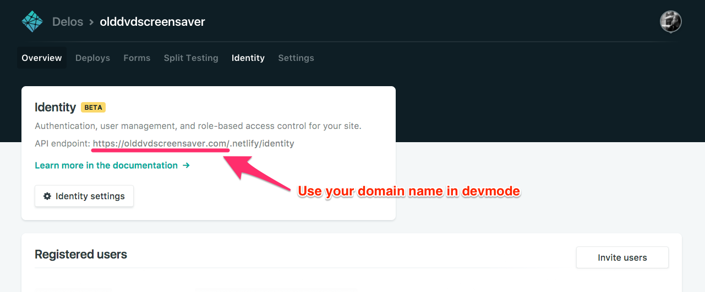

# Netlify Identity Widget (Vendored)

> **Note:** This package is deprecated by Netlify as of 2025. See [VENDOR_STATUS](#vendor-status) section below for details.


[](https://badge.fury.io/js/netlify-identity-widget)

A component used to authenticate with Netlify's Identity service.

[Live demo](https://identity.netlify.com)

For usage example with React and React Router, please see our `/example` folder and [read the README](https://github.com/netlify/netlify-identity-widget/tree/master/example).

## What is Netlify Identity

Netlify's Identity service is a plug-and-play microservice for handling site
functionalities like signups, logins, password recovery, user metadata, and
roles. You can use it from single page apps instead of rolling your own, and
integrate with any service that understands JSON Web Tokens (JWTs).

Learn more about this service from this
[blog post](https://www.netlify.com/blog/2017/09/07/introducing-built-in-identity-service-to-streamline-user-management/).

## Usage

Simply include the widget on your site, and things like invites, confirmation
codes, etc, will start working.

You can add controls for the widget with HTML:

```html
<!DOCTYPE html>
<html>
<head>
  <title>A static website</title>

  <!-- include the widget -->
  <script type="text/javascript" src="https://identity.netlify.com/v1/netlify-identity-widget.js"></script>
</head>
<body>
  <!-- Add a menu:
   Log in / Sign up - when the user is not logged in
   Username / Log out - when the user is logged in
  -->
  <div data-netlify-identity-menu></div>

  <!-- Add a simpler button:
    Simple button that will open the modal.
  -->
  <div data-netlify-identity-button>Login with Netlify Identity</div>
</body>
</html>
```

The widget will automatically attach itself to the window object as
`window.netlifyIdentity`.

You can use this global object like this:

```js
// Open the modal
netlifyIdentity.open();

// Get the current user:
// Available after on('init') is invoked
const user = netlifyIdentity.currentUser();

// Bind to events
netlifyIdentity.on('init', user => console.log('init', user));
netlifyIdentity.on('login', user => console.log('login', user));
netlifyIdentity.on('logout', () => console.log('Logged out'));
netlifyIdentity.on('error', err => console.error('Error', err));
netlifyIdentity.on('open', () => console.log('Widget opened'));
netlifyIdentity.on('close', () => console.log('Widget closed'));

// Unbind from events
netlifyIdentity.off('login'); // to unbind all registered handlers
netlifyIdentity.off('login', handler); // to unbind a single handler

// Close the modal
netlifyIdentity.close();

// Log out the user
netlifyIdentity.logout();

// Refresh the user's JWT
// Call in on('login') handler to ensure token refreshed after it expires (1hr)  
// Note: this method returns a promise.
netlifyIdentity.refresh().then((jwt)=>console.log(jwt))

// Change language
netlifyIdentity.setLocale('en');
```

#### A note on script tag versioning

The `v1` in the above URL is not pinned to the major version of the module API,
and will only reflect breaking changes in the markup API.

### Module API

Netlify Identity Widget also has a
[module API](https://www.npmjs.com/package/netlify-identity-widget):

```bash
yarn add netlify-identity-widget
```

Import or require as usual:

```js
const netlifyIdentity = require('netlify-identity-widget');

netlifyIdentity.init({
  container: '#netlify-modal', // defaults to document.body
  locale: 'en' // defaults to 'en'
});

netlifyIdentity.open(); // open the modal
netlifyIdentity.open('login'); // open the modal to the login tab
netlifyIdentity.open('signup'); // open the modal to the signup tab

netlifyIdentity.on('init', user => console.log('init', user));
netlifyIdentity.on('login', user => console.log('login', user));
netlifyIdentity.on('logout', () => console.log('Logged out'));
netlifyIdentity.on('error', err => console.error('Error', err));
netlifyIdentity.on('open', () => console.log('Widget opened'));
netlifyIdentity.on('close', () => console.log('Widget closed'));

// Unbind from events
netlifyIdentity.off('login'); // to unbind all registered handlers
netlifyIdentity.off('login', handler); // to unbind a single handler

// Close the modal
netlifyIdentity.close();

// Log out the user
netlifyIdentity.logout();

// refresh the user's JWT
// Note: this method returns a promise.
netlifyIdentity.refresh().then((jwt)=>console.log(jwt))

// Change language
netlifyIdentity.setLocale('en');

// Access the underlying GoTrue JS client.
// Note that doing things directly through the GoTrue client brings a risk of getting out of
// sync between your state and the widget’s state.
netlifyIdentity.gotrue;
```

#### `netlifyIdentity.init([opts])`

You can pass an optional `opts` object to configure the widget when using the
module API. Options include:

```js
{
  container: '#some-query-selector'; // container to attach to
  APIUrl: 'https://www.example.com/.netlify/functions/identity'; // Absolute url to endpoint.  ONLY USE IN SPECIAL CASES!
  namePlaceholder: 'some-placeholder-for-Name'; // custom placeholder for name input form
  locale: 'en'; // language code for translations - available: en, fr, es, pt, hu, pl, cs, sk - default to en
```

Generally avoid setting the `APIUrl`. You should only set this when your app is
served from a domain that differs from where the identity endpoint is served.
This is common for Cordova or Electron apps where you host from localhost or a
file.

## Localhost

When using the widget on localhost, it will prompt for your Netlify SiteURL the
first time it is opened. Entering the siteURL populates the browser's
localStorage.

This allows the widget to know which instance of Netlify Identity it should
communicate with zero configuration.

E.g. If your Netlify site is served from the `olddvdscreensaver.com` domain
name, enter the following when prompted by the widget when in development mode:

```
https://olddvdscreensaver.com
```



## List of Alternatives

**Lowest level JS Library**: If you want to use the official Javascript bindings to GoTrue, Netlify's underlying Identity service written in Go, use https://github.com/netlify/gotrue-js

**React bindings**: If you want a thin wrapper over Gotrue-js for React, `react-netlify-identity` is a "headless" library, meaning there is no UI exported and you will write your own UI to work with the authentication. https://github.com/sw-yx/react-netlify-identity

**High level overlay**: If you want a "widget" overlay that gives you a nice UI out of the box, with a somewhat larger bundle, check https://github.com/netlify/netlify-identity-widget

**High level popup**: If you want a popup window approach also with a nice UI out of the box, and don't mind the popup flow, check https://github.com/netlify/netlify-auth-providers

You can also see an example of wrapping netlify-identity-widget in a React Hook here: https://github.com/sw-yx/netlify-fauna-todo/blob/master/src/hooks/useNetlifyIdentity.js

## FAQ

* TypeScript Typings are maintained by @nkprince007 ([see PR](https://github.com/DefinitelyTyped/DefinitelyTyped/pull/30689)): `npm install @types/netlify-identity-widget` and then `import * as NetlifyIdentityWidget from "netlify-identity-widget"` (or `import NetlifyIdentityWidget from "netlify-identity-widget"` if you have `--allowSyntheticDefaultImports` on)

* If you experience a 404 while testing the Netlify Identity Widget on a local
  environment, you can manually remove the `netlifySiteURL` from localStorage by
  doing the following in the console.

```js
localStorage.removeItem('netlifySiteURL');
```

* See the `example` for how to integrate this widget with a react app.

---

## Vendor Status

# Netlify-Identity-Widget Vendor Status

## Overview
This is the official Netlify Identity Widget vendored for use in the Mumbling Mole project.

**Upstream Repository:** https://github.com/netlify/netlify-identity-widget  
**Vendor Type:** Unmodified upstream copy  
**Upstream Version:** v1.9.2  
**Vendored Version:** v1.9.2  
**Last Sync Date:** Unknown (vendored as-is)

---

## Why This is Vendored (Not Forked)

### Reasons for Vendoring

1. **Build Output Only**
   - Upstream distributes pre-built bundle: `build/netlify-identity.js`
   - No source modifications needed
   - Vendoring avoids CDN dependency for offline development

2. **Zero Modifications**
   - ❌ **No code changes**
   - ❌ **No build process changes**
   - ❌ **No dependency updates**
   - ✅ **Exact copy of upstream release**

3. **Deterministic Builds**
   - Using vendored copy ensures reproducible builds
   - No risk of CDN changes or downtime
   - Version locked to specific release

### Why Not Use NPM or CDN?

**Option: NPM Package**
```json
// Could use:
"dependencies": {
  "netlify-identity-widget": "^1.9.2"
}
```
- ❌ Requires build step or bundler integration
- ❌ Adds to node_modules bloat
- ✅ **Vendored instead:** Direct access to pre-built file

**Option: CDN Link**
```html
<!-- Could use: -->
<script src="https://identity.netlify.com/v1/netlify-identity-widget.js"></script>
```
- ❌ External dependency (breaks offline development)
- ❌ CDN availability risk
- ❌ Potential for unexpected updates
- ✅ **Vendored instead:** Local, reliable access

---

## Vendored Files

### Package Structure
```
vendors/netlify-identity-widget/
├── package.json           # Minimal metadata (name, version, main)
├── CHANGELOG.md           # Upstream changelog
├── CODE_OF_CONDUCT.md     # Upstream code of conduct
├── CONTRIBUTING.md        # Upstream contribution guide
├── LICENSE               # ISC License
├── README.md             # Upstream documentation
├── RELEASE.md            # Upstream release process
├── renovate.json         # Renovate config (unused)
├── releases/             # Pre-built distributions
│   └── v1.9.2/
│       └── netlify-identity.js  # Main file used
└── src/                  # Source code (not used directly)
    └── ...               # Full source tree
```

### Used Files
Only these files are actually used by Mumbling Mole:

```
✅ releases/v1.9.2/netlify-identity.js  # Loaded via <script> tag
✅ package.json                          # Version reference
```

### Unused Files (Kept for Reference)
```
ℹ️ src/                  # Source code (could rebuild if needed)
ℹ️ CHANGELOG.md          # Version history
ℹ️ README.md             # Documentation
📄 Other docs             # Contributing, license, etc.
```

---

## Integration with Mumbling Mole

### HTML Script Tag
```html
<!-- app/index.html -->
<script src="vendors/netlify-identity-widget/releases/v1.9.2/netlify-identity.js"></script>
```

### JavaScript Usage
```javascript
// app/index.js
if (window.netlifyIdentity && typeof window.netlifyIdentity.init === "function") {
  this.netlifyIdentity = window.netlifyIdentity;
} else {
  // Fallback if widget fails to load
  this.netlifyIdentity = {
    init: () => {},
    open: () => {},
    on: () => {},
    currentUser: () => null,
    logout: () => {},
    close: () => {},
  };
}
```

### Global API Used
```javascript
netlifyIdentity.init()                    // Initialize widget
netlifyIdentity.currentUser()             // Get logged-in user
netlifyIdentity.open('login')             // Open login modal
netlifyIdentity.on('login', callback)     // Event listener
netlifyIdentity.logout()                  // Log out user
```

---

## Upstream Package Details

### Full package.json (Upstream)
```json
{
  "name": "netlify-identity-widget",
  "description": "Netlify Identity widget for easy integration",
  "version": "1.9.2",
  "author": "Matt Biilmann <matt@netlify.com>",
  "bugs": {
    "url": "https://github.com/netlify/netlify-identity-widget/issues"
  },
  "dependencies": {},
  "devDependencies": {
    "@babel/cli": "^7.10.1",
    "@babel/core": "^7.10.2",
    // ... 40+ dev dependencies
  },
  "scripts": {
    "build": "cross-env NODE_ENV=production webpack",
    "dev": "webpack-dev-server --open",
    "test": "jest",
    // ... more scripts
  }
}
```

### Vendored package.json (Minimal)
```json
{
  "name": "netlify-identity-widget",
  "version": "1.9.2",
  "main": "build/netlify-identity.js"
}
```

**Why Minimal:**
- We only use pre-built file, not source
- Don't need build scripts or dev dependencies
- Keep vendor directory lightweight

---

## Version Information

### Current Version: v1.9.2
**Release Date:** Check https://github.com/netlify/netlify-identity-widget/releases/tag/v1.9.2

**Features in v1.9.2:**
- Full authentication flow (signup, login, password recovery)
- Email confirmation
- Role-based access control
- User metadata support
- Customizable UI

**Known Issues:**
- Check upstream issues: https://github.com/netlify/netlify-identity-widget/issues

---

## Update Strategy

### When to Update

**Check for Updates:**
- Quarterly review of upstream releases
- When security advisories are published
- When bugs affect Mumbling Mole functionality

**Update Triggers:**
- 🔴 **Security fixes** - Update immediately
- 🟡 **Bug fixes** - Update in next maintenance cycle
- 🟢 **New features** - Evaluate need, update if beneficial

### Update Process

1. **Check Latest Release**
   ```bash
   # Visit GitHub releases page
   open https://github.com/netlify/netlify-identity-widget/releases
   ```

2. **Download New Version**
   ```bash
   cd vendors/netlify-identity-widget/releases
   mkdir v1.9.3  # or new version
   cd v1.9.3
   curl -L -O https://github.com/netlify/netlify-identity-widget/releases/download/v1.9.3/netlify-identity.js
   ```

3. **Update References**
   ```bash
   # Update package.json version
   # Update HTML script tag path if needed
   ```

4. **Test Integration**
   ```bash
   npm run build
   npm run test
   # Manual testing of auth flows
   ```

5. **Update This Document**
   - Update version numbers
   - Note any breaking changes
   - Update last sync date

---

## Testing

### Upstream Tests
- ✅ Upstream has Jest test suite
- ✅ Maintained by Netlify team
- ℹ️ We don't run upstream tests (use pre-built)

### Integration Testing
```bash
# Build Mumbling Mole
npm run build

# Start dev server
./start-dev-server.sh

# Manual test checklist:
# □ Widget loads without errors
# □ Login modal opens
# □ User can sign up
# □ User can log in
# □ User metadata is accessible
# □ Logout works
```

### Fallback Testing
Verify fallback works if widget fails to load:
```javascript
// Temporarily break script tag, verify app doesn't crash
// Should use fallback mock object
```

---

## Compatibility

### Browser Support
Same as upstream widget:
- Chrome (latest)
- Firefox (latest)
- Safari 10+
- Edge (latest)
- Mobile browsers (iOS Safari, Chrome Mobile)

### Netlify Identity Service
Requires:
- Active Netlify site
- Netlify Identity enabled
- Proper site configuration

---

## Known Limitations

### 1. No Offline Mode
- **Issue:** Widget requires network access to Netlify Identity service
- **Impact:** Cannot authenticate offline
- **Workaround:** None (inherent limitation)

### 2. Vendor Lock-in
- **Issue:** Tightly coupled to Netlify Identity service
- **Impact:** Cannot easily migrate to other auth providers
- **Mitigation:** Consider auth abstraction layer (see TECHNICAL_DEBT_ANALYSIS.md)

### 3. Global Window Object
- **Issue:** Widget adds to global scope (`window.netlifyIdentity`)
- **Impact:** Potential naming conflicts
- **Mitigation:** Low risk (unique namespace)

---

## Alternatives Considered

### Option 1: Gotrue-JS (SDK)
```javascript
// Instead of widget, use SDK directly
import GoTrue from 'gotrue-js'
const auth = new GoTrue({
  APIUrl: 'https://yoursite.netlify.app/.netlify/identity',
  audience: '',
  setCookie: true
})
```
- **Pros:** More control, smaller bundle, headless
- **Cons:** Need to build custom UI

### Option 2: Auth0, Firebase Auth, etc.
- **Pros:** More features, better support
- **Cons:** Migration cost, different pricing

### Option 3: Roll Own Auth
- **Pros:** Full control, no vendor lock-in
- **Cons:** Security complexity, maintenance burden

**Current Choice:** Netlify Identity Widget
- ✅ Quick integration
- ✅ Good UI out of box
- ✅ Netlify hosting alignment
- ⚠️ Vendor lock-in acceptable for this project

---

## Documentation Links

- **Official Docs:** https://github.com/netlify/netlify-identity-widget
- **Netlify Identity:** https://docs.netlify.com/visitor-access/identity/
- **GoTrue API:** https://github.com/netlify/gotrue
- **Widget API:** See README.md in this directory

---

## Future Considerations

### Version 2.0 (If Released)
Monitor for major version updates:
- Review breaking changes
- Evaluate migration cost
- Test thoroughly before upgrading

### Alternative Auth Implementation
Consider abstracting auth to support:
- Multiple auth providers
- Self-hosted Mumble deployments
- Offline authentication

See `TECHNICAL_DEBT_ANALYSIS.md` Priority 2, Item #19 for details.

---

## Maintenance Checklist

### Quarterly Review
- [ ] Check for new upstream releases
- [ ] Review open issues affecting Mumbling Mole
- [ ] Verify no security advisories
- [ ] Update if beneficial

### On Each Mumbling Mole Release
- [ ] Verify auth flows work
- [ ] Test role-based access
- [ ] Validate user metadata access

---

## Contacts

**Upstream Maintainer:** Netlify Team  
**Upstream Issues:** https://github.com/netlify/netlify-identity-widget/issues  
**Netlify Support:** https://www.netlify.com/support/

**Mumbling Mole Maintainer:** Flexpair Team  
**Integration Questions:** Open issue in Mumbling Mole repo

---

**Vendor Status:** ✅ **Unmodified Upstream Copy**  
**Last Verified:** October 10, 2025  
**Next Review:** January 2026 (Quarterly)

---

## Contributing

# CONTRIBUTING

Contributions are always welcome, no matter how large or small. Before contributing,
please read the [code of conduct](CODE_OF_CONDUCT.md).

## Setup

> Install yarn on your system: https://yarnpkg.com/en/docs/install

```sh
$ git clone https://github.com/netlify/netlify-identity-widget
$ cd netlify-identity-widget
$ yarn
```

## Building

```sh
$ yarn build
```


## Running the server

```sh
$ yarn dev
```

## Pull Requests

We actively welcome your pull requests.

1. Fork the repo and create your branch from `master`.
2. If you've added code that should be tested, add tests.
3. If you've changed APIs, update the documentation.
4. Ensure the test suite passes.
5. Make sure your code lints.

## License

By contributing to Netlify Identity Widget, you agree that your contributions will be licensed
under its [MIT license](LICENSE).

---

## Code of Conduct

# Contributor Covenant Code of Conduct

## Our Pledge

In the interest of fostering an open and welcoming environment, we as
contributors and maintainers pledge to making participation in our project and
our community a harassment-free experience for everyone, regardless of age, body
size, disability, ethnicity, gender identity and expression, level of experience,
nationality, personal appearance, race, religion, or sexual identity and
orientation.

## Our Standards

Examples of behavior that contributes to creating a positive environment
include:

* Using welcoming and inclusive language
* Being respectful of differing viewpoints and experiences
* Gracefully accepting constructive criticism
* Focusing on what is best for the community
* Showing empathy towards other community members

Examples of unacceptable behavior by participants include:

* The use of sexualized language or imagery and unwelcome sexual attention or
advances
* Trolling, insulting/derogatory comments, and personal or political attacks
* Public or private harassment
* Publishing others' private information, such as a physical or electronic
  address, without explicit permission
* Other conduct which could reasonably be considered inappropriate in a
  professional setting

## Our Responsibilities

Project maintainers are responsible for clarifying the standards of acceptable
behavior and are expected to take appropriate and fair corrective action in
response to any instances of unacceptable behavior.

Project maintainers have the right and responsibility to remove, edit, or
reject comments, commits, code, wiki edits, issues, and other contributions
that are not aligned to this Code of Conduct, or to ban temporarily or
permanently any contributor for other behaviors that they deem inappropriate,
threatening, offensive, or harmful.

## Scope

This Code of Conduct applies both within project spaces and in public spaces
when an individual is representing the project or its community. Examples of
representing a project or community include using an official project e-mail
address, posting via an official social media account, or acting as an appointed
representative at an online or offline event. Representation of a project may be
further defined and clarified by project maintainers.

## Enforcement

Instances of abusive, harassing, or otherwise unacceptable behavior may be
reported by contacting the project team at david@netlify.com. All
complaints will be reviewed and investigated and will result in a response that
is deemed necessary and appropriate to the circumstances. The project team is
obligated to maintain confidentiality with regard to the reporter of an incident.
Further details of specific enforcement policies may be posted separately.

Project maintainers who do not follow or enforce the Code of Conduct in good
faith may face temporary or permanent repercussions as determined by other
members of the project's leadership.

## Attribution

This Code of Conduct is adapted from the [Contributor Covenant][homepage], version 1.4,
available at [http://contributor-covenant.org/version/1/4][version]

[homepage]: http://contributor-covenant.org
[version]: http://contributor-covenant.org/version/1/4/

---

## Release Process

# Release Checklist

Make sure you have npm + git credentials set up.

- [ ] Make changes and/or merge PRs.
- [ ] `git checkout master`
- [ ] `git pull`
- [ ] `npm version [ major | minor | patch ]`
- [ ] `npm run publish`

---

## Changelog

# Changelog

All notable changes to this project will be documented in this file.

The format is based on [Keep a Changelog](https://keepachangelog.com/en/1.0.0/)
and this project adheres to [Semantic Versioning](https://semver.org/spec/v2.0.0.html).

Generated by [`auto-changelog`](https://github.com/CookPete/auto-changelog).

## [v1.9.2](https://github.com/netlify/netlify-identity-widget/compare/v1.9.1...v1.9.2)

### Merged

- fix: remove identity prefix from site URL if exists [`#482`](https://github.com/netlify/netlify-identity-widget/pull/482)
- feat: Czech and Slovak translations [`#439`](https://github.com/netlify/netlify-identity-widget/pull/439)
- chore(deps): update dependency gh-release to v5 [`#422`](https://github.com/netlify/netlify-identity-widget/pull/422)
- feat: add polish translations [`#409`](https://github.com/netlify/netlify-identity-widget/pull/409)
- chore(deps): update dependency webpack-cli to v4 [`#387`](https://github.com/netlify/netlify-identity-widget/pull/387)
- chore(renovate): add pr labels [`#374`](https://github.com/netlify/netlify-identity-widget/pull/374)
- chore(deps): update dependency eslint-config-prettier to v8 [`#431`](https://github.com/netlify/netlify-identity-widget/pull/431)
- chore(deps): bump elliptic from 6.5.3 to 6.5.4 [`#436`](https://github.com/netlify/netlify-identity-widget/pull/436)
- chore(deps): bump elliptic from 6.5.3 to 6.5.4 in /example/react [`#437`](https://github.com/netlify/netlify-identity-widget/pull/437)
- chore(deps): bump ssri from 6.0.1 to 6.0.2 in /example/react [`#444`](https://github.com/netlify/netlify-identity-widget/pull/444)
- chore(deps): bump ssri from 6.0.1 to 6.0.2 [`#446`](https://github.com/netlify/netlify-identity-widget/pull/446)
- chore(deps): bump handlebars from 4.7.6 to 4.7.7 [`#448`](https://github.com/netlify/netlify-identity-widget/pull/448)
- chore(deps): bump url-parse from 1.4.7 to 1.5.1 [`#449`](https://github.com/netlify/netlify-identity-widget/pull/449)
- chore(deps): bump url-parse from 1.4.7 to 1.5.1 in /example/react [`#450`](https://github.com/netlify/netlify-identity-widget/pull/450)
- Fix: Replacement typo on `white-space` property [`#435`](https://github.com/netlify/netlify-identity-widget/pull/435)
- Add branded README image [`#434`](https://github.com/netlify/netlify-identity-widget/pull/434)
- chore(deps): update actions/setup-node action to v2 [`#411`](https://github.com/netlify/netlify-identity-widget/pull/411)
- chore(deps): lock file maintenance [`#392`](https://github.com/netlify/netlify-identity-widget/pull/392)
- chore(deps): update babel monorepo [`#390`](https://github.com/netlify/netlify-identity-widget/pull/390)
- chore(deps): update babel monorepo [`#338`](https://github.com/netlify/netlify-identity-widget/pull/338)
- chore(deps): bump node-fetch from 2.6.0 to 2.6.1 [`#364`](https://github.com/netlify/netlify-identity-widget/pull/364)
- chore: module example code typo [`#359`](https://github.com/netlify/netlify-identity-widget/pull/359)
- feat: Russian translation [`#354`](https://github.com/netlify/netlify-identity-widget/pull/354)
- chore: clarify use of global script version [`#357`](https://github.com/netlify/netlify-identity-widget/pull/357)
- feat: Portuguese translation [`#352`](https://github.com/netlify/netlify-identity-widget/pull/352)
- fix: add missing translations [`#353`](https://github.com/netlify/netlify-identity-widget/pull/353)

### Fixed

- chore: clarify use of global script version (#357) [`#355`](https://github.com/netlify/netlify-identity-widget/issues/355)

### Commits

- Update yarn lockfile [`ad7d5c6`](https://github.com/netlify/netlify-identity-widget/commit/ad7d5c6c89cf2006f8f78619f42edaf2abe84a63)
- chore(deps): update jest monorepo to v26.6.3 [`6fadf3b`](https://github.com/netlify/netlify-identity-widget/commit/6fadf3b4ca834f097647e95f966fc877cdc7bf30)
- chore(deps): update dependency eslint to v7.26.0 [`e47ee6f`](https://github.com/netlify/netlify-identity-widget/commit/e47ee6fd642581cc67fc2d1e05cb26fc4f632f35)

## [v1.9.1](https://github.com/netlify/netlify-identity-widget/compare/v1.9.0...v1.9.1) - 2020-07-30

### Merged

- fix: increase input size to avoid mobile zoom [`#334`](https://github.com/netlify/netlify-identity-widget/pull/334)
- Feat: Hungarian translation [`#330`](https://github.com/netlify/netlify-identity-widget/pull/330)

### Fixed

- fix: increase input size to avoid mobile zoom [`#236`](https://github.com/netlify/netlify-identity-widget/issues/236)

### Commits

- hungarian translation [`ebcf2c9`](https://github.com/netlify/netlify-identity-widget/commit/ebcf2c9ed60e919846176cdcf54fad694b93cf13)
- removed '...'s as they're added outside of the translation files [`0e4f728`](https://github.com/netlify/netlify-identity-widget/commit/0e4f728b138928a99885f5354391014ed902dc58)
- fixed indentation and capitalization [`c54bfaf`](https://github.com/netlify/netlify-identity-widget/commit/c54bfaf9c5936f18e0b018af71c5973c5742b552)

## [v1.9.0](https://github.com/netlify/netlify-identity-widget/compare/v1.8.1...v1.9.0) - 2020-07-29

### Merged

- feat: Add the ability to clear an invalid site URL [`#305`](https://github.com/netlify/netlify-identity-widget/pull/305)

## [v1.8.1](https://github.com/netlify/netlify-identity-widget/compare/v1.8.0...v1.8.1) - 2020-07-29

### Merged

- fix: ReferenceError: window is not defined [`#319`](https://github.com/netlify/netlify-identity-widget/pull/319)
- Feat: Update Spanish translation  [`#333`](https://github.com/netlify/netlify-identity-widget/pull/333)
- Update correct dependencies [`#332`](https://github.com/netlify/netlify-identity-widget/pull/332)
- Feat: Add Spanish translation [`#327`](https://github.com/netlify/netlify-identity-widget/pull/327)
- Fix: Make "French" into "Français" [`#328`](https://github.com/netlify/netlify-identity-widget/pull/328)
- fix(deps): update dependency react-scripts to v3 [`#312`](https://github.com/netlify/netlify-identity-widget/pull/312)
- ci: switch to github actions [`#325`](https://github.com/netlify/netlify-identity-widget/pull/325)
- chore(deps): remove unused raw-loader dependency [`#304`](https://github.com/netlify/netlify-identity-widget/pull/304)
- chore: remove package-lock.json [`#303`](https://github.com/netlify/netlify-identity-widget/pull/303)
- fix: prevent double initialization [`#284`](https://github.com/netlify/netlify-identity-widget/pull/284)
- chore(deps): lock file maintenance [`#323`](https://github.com/netlify/netlify-identity-widget/pull/323)
- chore(deps): update dependency rimraf to v3 [`#301`](https://github.com/netlify/netlify-identity-widget/pull/301)

### Commits

- feat: adding Spanish translation [`54ed057`](https://github.com/netlify/netlify-identity-widget/commit/54ed057e06e1a97e5573f97f671eae62d1e94fa4)
- Feat: Update Spanish translation to an informal, friendly tone [`c27a300`](https://github.com/netlify/netlify-identity-widget/commit/c27a300e9330c8cdf46d08f60889799af37d9132)
- chore(deps): update dependency caniuse-lite to v1.0.30001104 [`ececa82`](https://github.com/netlify/netlify-identity-widget/commit/ececa82560ac4cd384e07ed5461601292cfb1847)

## [v1.8.0](https://github.com/netlify/netlify-identity-widget/compare/v1.7.0...v1.8.0) - 2020-07-06

### Merged

- feat: add support for unregistering event handlers [`#283`](https://github.com/netlify/netlify-identity-widget/pull/283)
- fix: changes the form type to name [`#286`](https://github.com/netlify/netlify-identity-widget/pull/286)
- chore(deps): lock file maintenance [`#302`](https://github.com/netlify/netlify-identity-widget/pull/302)

## [v1.7.0](https://github.com/netlify/netlify-identity-widget/compare/v1.6.0...v1.7.0) - 2020-06-30

### Merged

- feat: Indicate via @autocomplete whether a password field is for new or current values [`#275`](https://github.com/netlify/netlify-identity-widget/pull/275)
- chore: update gotrue-js [`#282`](https://github.com/netlify/netlify-identity-widget/pull/282)
- chore(deps): lock file maintenance [`#281`](https://github.com/netlify/netlify-identity-widget/pull/281)
- chore(deps): update dependency mkdirp to v1 [`#272`](https://github.com/netlify/netlify-identity-widget/pull/272)
- chore(deps): lock file maintenance [`#273`](https://github.com/netlify/netlify-identity-widget/pull/273)
- chore(deps): lock file maintenance [`#267`](https://github.com/netlify/netlify-identity-widget/pull/267)
- feat: add multilingual support [`#238`](https://github.com/netlify/netlify-identity-widget/pull/238)
- chore(deps): update babel [`#261`](https://github.com/netlify/netlify-identity-widget/pull/261)
- chore(deps): update dependency webpack to v4 [`#247`](https://github.com/netlify/netlify-identity-widget/pull/247)
- chore(deps): update dependency css-loader to v3 [`#253`](https://github.com/netlify/netlify-identity-widget/pull/253)
- chore(deps): update dependency file-loader to v6 [`#257`](https://github.com/netlify/netlify-identity-widget/pull/257)
- chore(deps): lock file maintenance [`#260`](https://github.com/netlify/netlify-identity-widget/pull/260)
- chore(deps): update dependency cross-env to v7 [`#252`](https://github.com/netlify/netlify-identity-widget/pull/252)
- chore(deps): update dependency auto-changelog to v2 [`#251`](https://github.com/netlify/netlify-identity-widget/pull/251)
- chore(deps): lock file maintenance [`#259`](https://github.com/netlify/netlify-identity-widget/pull/259)
- chore(deps): lock file maintenance [`#246`](https://github.com/netlify/netlify-identity-widget/pull/246)
- chore(deps): update dependency webpack-dev-server to v3 [security] [`#242`](https://github.com/netlify/netlify-identity-widget/pull/242)
- chore: add renovate.json [`#241`](https://github.com/netlify/netlify-identity-widget/pull/241)
- github tools: add fossa license scanning [`#239`](https://github.com/netlify/netlify-identity-widget/pull/239)

### Commits

- create github actions workflow files for fossa [`bf1b9f1`](https://github.com/netlify/netlify-identity-widget/commit/bf1b9f1b9e21eacbdda30600aa1e33c05c45c6f2)
- fix(docs): change `yarn start` to `yarn dev` in CONTRIBUTING.md [`e18b76e`](https://github.com/netlify/netlify-identity-widget/commit/e18b76ee47a0ac36fae8d6f40e92bd9fe0e75de7)

## [v1.6.0](https://github.com/netlify/netlify-identity-widget/compare/v1.5.6...v1.6.0) - 2020-05-08

### Merged

- added refresh method from gotrue [`#237`](https://github.com/netlify/netlify-identity-widget/pull/237)
- Bump handlebars from 4.2.0 to 4.5.3 in /example/react [`#228`](https://github.com/netlify/netlify-identity-widget/pull/228)
- Bump handlebars from 4.2.1 to 4.5.3 [`#227`](https://github.com/netlify/netlify-identity-widget/pull/227)

### Commits

- updating README [`2a0a7ba`](https://github.com/netlify/netlify-identity-widget/commit/2a0a7ba909fd79f4fed00637af5bad54b242d4f4)

## [v1.5.6](https://github.com/netlify/netlify-identity-widget/compare/v1.5.5...v1.5.6) - 2019-12-02

### Merged

- fix: don't open modal when using implicit auth from cms [`#223`](https://github.com/netlify/netlify-identity-widget/pull/223)
- Add an example in Svelte [`#218`](https://github.com/netlify/netlify-identity-widget/pull/218)
- Bump handlebars from 4.0.12 to 4.2.1 [`#216`](https://github.com/netlify/netlify-identity-widget/pull/216)
- Bump lodash from 4.17.11 to 4.17.15 [`#211`](https://github.com/netlify/netlify-identity-widget/pull/211)
- Bump clean-css from 4.1.9 to 4.1.11 in /example/react [`#208`](https://github.com/netlify/netlify-identity-widget/pull/208)
- Bump handlebars from 4.0.12 to 4.2.0 [`#205`](https://github.com/netlify/netlify-identity-widget/pull/205)
- Bump eslint-utils from 1.3.1 to 1.4.2 in /example/react [`#207`](https://github.com/netlify/netlify-identity-widget/pull/207)
- Bump lodash.template from 4.4.0 to 4.5.0 in /example/react [`#213`](https://github.com/netlify/netlify-identity-widget/pull/213)
- Bump sshpk from 1.13.1 to 1.16.1 in /example/react [`#212`](https://github.com/netlify/netlify-identity-widget/pull/212)
- Bump diff from 3.3.1 to 3.5.0 in /example/react [`#204`](https://github.com/netlify/netlify-identity-widget/pull/204)
- Bump mixin-deep from 1.3.1 to 1.3.2 [`#202`](https://github.com/netlify/netlify-identity-widget/pull/202)
- Bump lodash.template from 4.4.0 to 4.5.0 [`#209`](https://github.com/netlify/netlify-identity-widget/pull/209)
- Bump js-yaml from 3.10.0 to 3.13.1 in /example/react [`#214`](https://github.com/netlify/netlify-identity-widget/pull/214)
- Bump mixin-deep from 1.3.1 to 1.3.2 in /example/react [`#210`](https://github.com/netlify/netlify-identity-widget/pull/210)
- Bump merge from 1.2.0 to 1.2.1 in /example/react [`#215`](https://github.com/netlify/netlify-identity-widget/pull/215)
- Bump handlebars from 4.0.10 to 4.2.0 in /example/react [`#206`](https://github.com/netlify/netlify-identity-widget/pull/206)
- Bump hoek from 4.2.0 to 4.2.1 in /example/react [`#203`](https://github.com/netlify/netlify-identity-widget/pull/203)
- Set the iframe title to comply with accessible best practices. [`#200`](https://github.com/netlify/netlify-identity-widget/pull/200)

### Commits

- Add Svelte README [`baf7b77`](https://github.com/netlify/netlify-identity-widget/commit/baf7b774dbe49b80688a628209bbb2d3ba5dcddd)
- remove identity site from local host list [`623be68`](https://github.com/netlify/netlify-identity-widget/commit/623be680d443ddc7366d8c242c48f122319a4b2e)

## [v1.5.5](https://github.com/netlify/netlify-identity-widget/compare/v1.5.4...v1.5.5) - 2019-06-07

### Merged

- fix: ensure dev settings for url is only visible on dev [`#191`](https://github.com/netlify/netlify-identity-widget/pull/191)

### Commits

- prettifying [`528cdab`](https://github.com/netlify/netlify-identity-widget/commit/528cdab999335d111add757cc0688342790a9a6e)
- fix: extrapolate dev mode check into function that saves to store [`c992ce4`](https://github.com/netlify/netlify-identity-widget/commit/c992ce4b718bac0ab6a78cab9ef6b45fde17c667)
- fix: ensure isLocal boolean is set on init [`5b46e0f`](https://github.com/netlify/netlify-identity-widget/commit/5b46e0fd6be5f65dd99dd9d4ca1f8f71676bf3e8)

## [v1.5.4](https://github.com/netlify/netlify-identity-widget/compare/v1.5.3...v1.5.4) - 2019-05-21

### Commits

- store access token from external provider as jwt cookie [`dc45eb1`](https://github.com/netlify/netlify-identity-widget/commit/dc45eb146f434e7e1147679bd24f11241f24305f)

## [v1.5.3](https://github.com/netlify/netlify-identity-widget/compare/v1.5.2...v1.5.3) - 2019-05-21

### Merged

- Added custom placeholder option [`#178`](https://github.com/netlify/netlify-identity-widget/pull/178)
- chore: Add feature to switch out identity url [`#174`](https://github.com/netlify/netlify-identity-widget/pull/174)
- add an example in Vue.js [`#167`](https://github.com/netlify/netlify-identity-widget/pull/167)

### Commits

- merge [`475a697`](https://github.com/netlify/netlify-identity-widget/commit/475a697c60086600f9201871ec66c705a68f603a)
- Set up example folders [`1b86b7a`](https://github.com/netlify/netlify-identity-widget/commit/1b86b7af319494087cebde404b0c6b696af19843)
- add cookies on external login [`595cb1c`](https://github.com/netlify/netlify-identity-widget/commit/595cb1cf5fab3d99f1015f47ed1b81c9bc14836d)

## [v1.5.2](https://github.com/netlify/netlify-identity-widget/compare/v1.5.1...v1.5.2) - 2018-12-06

### Merged

- Remove devDep from deps and fix release flow [`#170`](https://github.com/netlify/netlify-identity-widget/pull/170)

## [v1.5.1](https://github.com/netlify/netlify-identity-widget/compare/v1.5.0...v1.5.1) - 2018-11-29

### Commits

- Fix changelog format [`82df99c`](https://github.com/netlify/netlify-identity-widget/commit/82df99c7572f896ff432add7aed28d700605b722)
- Fixpack [`aa8a774`](https://github.com/netlify/netlify-identity-widget/commit/aa8a7743f7e2b0543c8f32de145bba62060366e4)

## [v1.5.0](https://github.com/netlify/netlify-identity-widget/compare/v1.4.15...v1.5.0) - 2018-11-29

### Merged

- Semver updates and release tweaks [`#164`](https://github.com/netlify/netlify-identity-widget/pull/164)
- Allow display of SAML provider button [`#150`](https://github.com/netlify/netlify-identity-widget/pull/150)

### Commits

- Update semver deps [`738dedb`](https://github.com/netlify/netlify-identity-widget/commit/738dedbca56c69a0a0c53d38b877320767b0aa9c)
- Add a publish script [`15ccd0a`](https://github.com/netlify/netlify-identity-widget/commit/15ccd0a2ac420438699d681c496d88b3ec3f0c59)
- Allow override of provider names from settings [`ca4dea6`](https://github.com/netlify/netlify-identity-widget/commit/ca4dea6fcf47ea1073c8a621524295313da962c3)

## [v1.4.15](https://github.com/netlify/netlify-identity-widget/compare/v1.4.14...v1.4.15) - 2019-05-21

### Merged

- Remove redundant `with` [`#155`](https://github.com/netlify/netlify-identity-widget/pull/155)
- fix small copy/paste error (again) [`#154`](https://github.com/netlify/netlify-identity-widget/pull/154)
- Fix small copy/paste error [`#153`](https://github.com/netlify/netlify-identity-widget/pull/153)

### Commits

- fix [`1b3252f`](https://github.com/netlify/netlify-identity-widget/commit/1b3252ff1f88d085cf4bcc30366ba10f21d90f01)
- add cookies on external login [`595cb1c`](https://github.com/netlify/netlify-identity-widget/commit/595cb1cf5fab3d99f1015f47ed1b81c9bc14836d)
- examples [`154bc0b`](https://github.com/netlify/netlify-identity-widget/commit/154bc0b64f5cb0c29d6a99605e8311d5a50a37c0)

## [v1.4.14](https://github.com/netlify/netlify-identity-widget/compare/v1.4.13...v1.4.14) - 2018-06-07

### Commits

- Bump gotrue  [`d65a5e7`](https://github.com/netlify/netlify-identity-widget/commit/d65a5e71a3127f2e4addadc52b90b8f0773478dd)

## [v1.4.13](https://github.com/netlify/netlify-identity-widget/compare/v1.4.12...v1.4.13) - 2018-06-01

### Merged

- update icon on name field [`#141`](https://github.com/netlify/netlify-identity-widget/pull/141)

### Commits

- update name class [`8e7a87e`](https://github.com/netlify/netlify-identity-widget/commit/8e7a87e360d37367db923d17120979cc5f768101)

## [v1.4.12](https://github.com/netlify/netlify-identity-widget/compare/v1.4.11...v1.4.12) - 2018-05-07

### Merged

- Support async loading [`#126`](https://github.com/netlify/netlify-identity-widget/pull/126)
- fixed "login" parameter in module API [`#136`](https://github.com/netlify/netlify-identity-widget/pull/136)
- Make Close Button bigger and centered [`#134`](https://github.com/netlify/netlify-identity-widget/pull/134)
- Clarify local Site URL popup. [`#124`](https://github.com/netlify/netlify-identity-widget/pull/124)

### Commits

- Update siteurl.js [`a9ffa49`](https://github.com/netlify/netlify-identity-widget/commit/a9ffa496b168d3ed66da037f94a9e3e6a3c08516)

## [v1.4.11](https://github.com/netlify/netlify-identity-widget/compare/v1.4.10...v1.4.11) - 2018-02-09

### Merged

- Improve hash cleaning regex [`#120`](https://github.com/netlify/netlify-identity-widget/pull/120)

### Commits

- Update yarn.lock [`c3592fb`](https://github.com/netlify/netlify-identity-widget/commit/c3592fb9d28b2d98bbe6cedb8ce14d090021cc03)
- Wrong slash  [`35b9e01`](https://github.com/netlify/netlify-identity-widget/commit/35b9e018798a0dd213332b64a3e29d1bb2314981)

## [v1.4.10](https://github.com/netlify/netlify-identity-widget/compare/v1.4.9...v1.4.10) - 2018-02-08

### Commits

- Update gotrue-js@0.9.20 [`ad30fe8`](https://github.com/netlify/netlify-identity-widget/commit/ad30fe824cf49d0f3e4f41093c658cb88c44c102)

## [v1.4.9](https://github.com/netlify/netlify-identity-widget/compare/v1.4.8...v1.4.9) - 2018-01-29

### Commits

- Update to gotrue-js@0.9.19 [`1315867`](https://github.com/netlify/netlify-identity-widget/commit/1315867425b44c664bae961f6e75b423eb10e5e2)

## [v1.4.8](https://github.com/netlify/netlify-identity-widget/compare/v1.4.7...v1.4.8) - 2018-01-29

### Commits

- Don’t drop console logs [`ffd15c9`](https://github.com/netlify/netlify-identity-widget/commit/ffd15c95af8a1ba8d1335ad7620af62a74a8f5dd)

## [v1.4.7](https://github.com/netlify/netlify-identity-widget/compare/v1.4.6...v1.4.7) - 2018-01-29

### Commits

- Update to gotrue-js@0.9.18 [`754db7f`](https://github.com/netlify/netlify-identity-widget/commit/754db7fa10812a5e738f4c436fdb10802b69b30a)

## [v1.4.6](https://github.com/netlify/netlify-identity-widget/compare/v1.4.5...v1.4.6) - 2018-01-29

### Commits

- Update to gotrue-js@0.9.17 [`73397fd`](https://github.com/netlify/netlify-identity-widget/commit/73397fd50d0b5ee0b35337b6f0a73878c1860694)

## [v1.4.5](https://github.com/netlify/netlify-identity-widget/compare/v1.4.4...v1.4.5) - 2018-01-29

### Commits

- Update deps [`8067f1e`](https://github.com/netlify/netlify-identity-widget/commit/8067f1e36c3a919e778174485ce9cf5fdf2b7202)
- Add another page [`358101e`](https://github.com/netlify/netlify-identity-widget/commit/358101ee51a3d75350edf84443553987046dca05)

## [v1.4.4](https://github.com/netlify/netlify-identity-widget/compare/v1.4.3...v1.4.4) - 2018-01-25

### Merged

- Fix source maps on UMD [`#114`](https://github.com/netlify/netlify-identity-widget/pull/114)

## [v1.4.3](https://github.com/netlify/netlify-identity-widget/compare/v1.4.2...v1.4.3) - 2018-01-15

### Merged

- Fix adblock pro blocking [`#113`](https://github.com/netlify/netlify-identity-widget/pull/113)

### Commits

- Restore production on UMD builds [`a9f5bb8`](https://github.com/netlify/netlify-identity-widget/commit/a9f5bb86ffc2b5df6d2849ffc850b5a0f103f0fd)

## [v1.4.2](https://github.com/netlify/netlify-identity-widget/compare/v1.4.2-beta-2...v1.4.2) - 2018-01-08

### Merged

- Rebundle [`#112`](https://github.com/netlify/netlify-identity-widget/pull/112)

## [v1.4.2-beta-2](https://github.com/netlify/netlify-identity-widget/compare/v1.4.2-beta...v1.4.2-beta-2) - 2018-01-08

### Commits

- Transform EVERYTHING [`e2ef304`](https://github.com/netlify/netlify-identity-widget/commit/e2ef30424f60a04eee4f65912a352191b714ee4e)

## [v1.4.2-beta](https://github.com/netlify/netlify-identity-widget/compare/v1.4.1...v1.4.2-beta) - 2018-01-05

### Commits

- Babelify mobx and preact for prerender support [`d1038f1`](https://github.com/netlify/netlify-identity-widget/commit/d1038f1d50ee6d36198210b99aaae47037bbf37c)

## [v1.4.1](https://github.com/netlify/netlify-identity-widget/compare/v1.4.0...v1.4.1) - 2017-12-22

### Commits

- Fix logo option regression [`b592479`](https://github.com/netlify/netlify-identity-widget/commit/b59247950eb44875f0d92c6346997ab6b6ee1f17)

## [v1.4.0](https://github.com/netlify/netlify-identity-widget/compare/v1.3.5...v1.4.0) - 2017-12-21

### Merged

- Add APIUrl option to module API [`#103`](https://github.com/netlify/netlify-identity-widget/pull/103)

### Commits

- Clarify why are adding this option. [`e7bdf60`](https://github.com/netlify/netlify-identity-widget/commit/e7bdf601d4ba6d51764fe3ba5848a5e91e98a6ea)
- Handle error state when settings endpoint fails [`c58aa6c`](https://github.com/netlify/netlify-identity-widget/commit/c58aa6cb09d0a5a293dbecdc48c24bef5ca2c058)
- Fix Typos [`36d8789`](https://github.com/netlify/netlify-identity-widget/commit/36d87897dc2686ce2cccb18dc6527dd1cdab6317)

## [v1.3.5](https://github.com/netlify/netlify-identity-widget/compare/v1.3.4...v1.3.5) - 2017-12-21

### Merged

- Update gotrue and bump the widget version [`#98`](https://github.com/netlify/netlify-identity-widget/pull/98)

### Commits

- New release [`eac1b38`](https://github.com/netlify/netlify-identity-widget/commit/eac1b38e2cbeba591cf77d08d5c07c26aa904b55)

## [v1.3.4](https://github.com/netlify/netlify-identity-widget/compare/v1.3.3...v1.3.4) - 2017-11-17

### Merged

- Add signup button action to public api [`#97`](https://github.com/netlify/netlify-identity-widget/pull/97)

### Commits

- Reformat README and add  [`5afbdf8`](https://github.com/netlify/netlify-identity-widget/commit/5afbdf8d45b8e54d9bc808332cffebcccba199d1)
- Remove defer suggestion from readme [`0c14ab3`](https://github.com/netlify/netlify-identity-widget/commit/0c14ab31777528639ab22437d0f8a206915372d1)

## [v1.3.3](https://github.com/netlify/netlify-identity-widget/compare/v1.3.2...v1.3.3) - 2017-11-10

### Merged

- Add z-index to the iframe and fix #94 [`#95`](https://github.com/netlify/netlify-identity-widget/pull/95)

### Fixed

- Merge pull request #95 from carlosfaria94/master [`#94`](https://github.com/netlify/netlify-identity-widget/issues/94)
- Add z-index to the iframe and fix #94 [`#94`](https://github.com/netlify/netlify-identity-widget/issues/94)

## [v1.3.2](https://github.com/netlify/netlify-identity-widget/compare/v1.3.1...v1.3.2) - 2017-11-09

### Merged

- Dont start action unless there is a user [`#93`](https://github.com/netlify/netlify-identity-widget/pull/93)

## [v1.3.1](https://github.com/netlify/netlify-identity-widget/compare/v1.3.0...v1.3.1) - 2017-11-09

### Merged

- Clear saving state when logout is called without a user [`#92`](https://github.com/netlify/netlify-identity-widget/pull/92)

### Commits

- Prettier [`c96ee92`](https://github.com/netlify/netlify-identity-widget/commit/c96ee92622be359e4f7a61a1d06698fbe77cfc0a)

## [v1.3.0](https://github.com/netlify/netlify-identity-widget/compare/v1.2.0...v1.3.0) - 2017-11-09

### Merged

- Enable sourcemaps [`#91`](https://github.com/netlify/netlify-identity-widget/pull/91)

### Commits

- Add clean step to build [`c42dfc6`](https://github.com/netlify/netlify-identity-widget/commit/c42dfc60e2c5c03bff755a4ffc2b82feb6987ec7)
- Clean up clean step  [`6bfa31f`](https://github.com/netlify/netlify-identity-widget/commit/6bfa31fe6e5ab6b61e66ce4b4bd82289c5bc5234)
- Clean build dir [`a9295dc`](https://github.com/netlify/netlify-identity-widget/commit/a9295dc576e8a331d552a0fed553e49d96ffb4be)

## [v1.2.0](https://github.com/netlify/netlify-identity-widget/compare/v1.1.2...v1.2.0) - 2017-10-10

### Merged

- Add option to disable logo [`#79`](https://github.com/netlify/netlify-identity-widget/pull/79)
- Add devmode instructions [`#75`](https://github.com/netlify/netlify-identity-widget/pull/75)

### Commits

- Add react example to repo [`fc4fd70`](https://github.com/netlify/netlify-identity-widget/commit/fc4fd707df12a7af2f12989bdd42664dbc45b549)
- Docs edits [`31835f8`](https://github.com/netlify/netlify-identity-widget/commit/31835f826e6aa08e81f6e736b335e2c1dbd6c27c)
- Update copy and screenshot [`6000c64`](https://github.com/netlify/netlify-identity-widget/commit/6000c64bd8f3fd1e8a2deaa0193ed4558801bcc2)

## [v1.1.2](https://github.com/netlify/netlify-identity-widget/compare/v1.1.1...v1.1.2) - 2017-10-09

### Commits

- Update gotrue [`9b88aa5`](https://github.com/netlify/netlify-identity-widget/commit/9b88aa5a21ba81e7bb51b7a0c53f500963e7707d)

## [v1.1.1](https://github.com/netlify/netlify-identity-widget/compare/v1.1.0...v1.1.1) - 2017-10-06

### Commits

- Update gotrue [`cb1f06b`](https://github.com/netlify/netlify-identity-widget/commit/cb1f06b6fbf2a1fc6e50250f3faad5f43504379f)
- Update version [`62468fc`](https://github.com/netlify/netlify-identity-widget/commit/62468fcff2795ce4335223c2cd344626593770bd)

## [v1.1.0](https://github.com/netlify/netlify-identity-widget/compare/v1.0.2...v1.1.0) - 2017-10-06

### Merged

- Set a cookie when not using cors [`#74`](https://github.com/netlify/netlify-identity-widget/pull/74)
- Update README.md [`#72`](https://github.com/netlify/netlify-identity-widget/pull/72)

### Commits

- Upgrade gotrue-js [`c6d2c38`](https://github.com/netlify/netlify-identity-widget/commit/c6d2c382fe8ee17e9d99bf2a0af0b71ef94ac677)

## [v1.0.2](https://github.com/netlify/netlify-identity-widget/compare/v1.0.1...v1.0.2) - 2017-09-27

### Merged

- add FAQ to readme [`#70`](https://github.com/netlify/netlify-identity-widget/pull/70)
- removes the relative or [`#69`](https://github.com/netlify/netlify-identity-widget/pull/69)
- Partial Revert of "Add init event to netlifyIdentity" [`#66`](https://github.com/netlify/netlify-identity-widget/pull/66)

### Commits

- Revert "Add init event to netlifyIdentity" [`8094df8`](https://github.com/netlify/netlify-identity-widget/commit/8094df8621cb5ea7991b6893cd06f07cab2bb3df)
- Minor eslint changes [`c08e872`](https://github.com/netlify/netlify-identity-widget/commit/c08e87290c17037357af8e406170e414450cb01f)
- Fix weird render of OR on HR [`c32e17d`](https://github.com/netlify/netlify-identity-widget/commit/c32e17d2a9baca9d511e34999d9f2ecd994578fc)

## [v1.0.1](https://github.com/netlify/netlify-identity-widget/compare/v1.0.0...v1.0.1) - 2017-09-09

### Merged

- Fix module API export [`#65`](https://github.com/netlify/netlify-identity-widget/pull/65)

### Commits

- Fix module build [`cd2eb1b`](https://github.com/netlify/netlify-identity-widget/commit/cd2eb1bb95e841775b6738246b09392ee102bbf2)
- Fix module export [`e5608be`](https://github.com/netlify/netlify-identity-widget/commit/e5608be1e6c2cb7d76c84fe02cd7ce83aabb93df)
- Validate script tag global variable API [`48cb8cf`](https://github.com/netlify/netlify-identity-widget/commit/48cb8cf7be8fa15a3dfe527d14ab24a73f60e5b0)

## v1.0.0 - 2017-09-08

### Merged

- Draft release doc [`#63`](https://github.com/netlify/netlify-identity-widget/pull/63)
- Also make sure we can still build. [`#64`](https://github.com/netlify/netlify-identity-widget/pull/64)
- Add init event to netlifyIdentity [`#62`](https://github.com/netlify/netlify-identity-widget/pull/62)
- Replace GitHub ribbon with simpler link [`#61`](https://github.com/netlify/netlify-identity-widget/pull/61)
- Don’t kick off loading state when linking to providers [`#59`](https://github.com/netlify/netlify-identity-widget/pull/59)
- Add links/badges to demo site [`#60`](https://github.com/netlify/netlify-identity-widget/pull/60)
- Release with more fixes [`#58`](https://github.com/netlify/netlify-identity-widget/pull/58)
- Enable providers on accept invite page [`#56`](https://github.com/netlify/netlify-identity-widget/pull/56)
- Turn off hmr in devmode [`#52`](https://github.com/netlify/netlify-identity-widget/pull/52)
- Upgrade gotrue-js [`#55`](https://github.com/netlify/netlify-identity-widget/pull/55)
- Created new release for version v1 [`#54`](https://github.com/netlify/netlify-identity-widget/pull/54)
- Enable travis [`#51`](https://github.com/netlify/netlify-identity-widget/pull/51)
- console.error instead of log [`#50`](https://github.com/netlify/netlify-identity-widget/pull/50)
- Fix lint/format [`#45`](https://github.com/netlify/netlify-identity-widget/pull/45)
- Fix logged in state styling [`#44`](https://github.com/netlify/netlify-identity-widget/pull/44)
- Demo page refactor [`#43`](https://github.com/netlify/netlify-identity-widget/pull/43)
- Fix readme [`#41`](https://github.com/netlify/netlify-identity-widget/pull/41)
- [WIP] Style Dev Mode [`#31`](https://github.com/netlify/netlify-identity-widget/pull/31)
- Fix race condition on currentUser call [`#38`](https://github.com/netlify/netlify-identity-widget/pull/38)
- Fix remaining listing errors.  Prettier should work now. [`#35`](https://github.com/netlify/netlify-identity-widget/pull/35)
- Add aria-hidden attribute to dialog [`#36`](https://github.com/netlify/netlify-identity-widget/pull/36)
- Fix viewport warnings on safari [`#33`](https://github.com/netlify/netlify-identity-widget/pull/33)
- Add some css to the template so rafa can go play later [`#32`](https://github.com/netlify/netlify-identity-widget/pull/32)
- Fix a race condition [`#34`](https://github.com/netlify/netlify-identity-widget/pull/34)
- Remove unused packages and fix lint errors [`#30`](https://github.com/netlify/netlify-identity-widget/pull/30)

### Fixed

- Don’t kick off loading state when linking to providers [`#47`](https://github.com/netlify/netlify-identity-widget/issues/47)

### Commits

- Fix format of webpack config [`4094ce8`](https://github.com/netlify/netlify-identity-widget/commit/4094ce833dea7f2fff5fb7b6d88d7dd6a4a4b624)
- Add styling to markup [`a9c5fc7`](https://github.com/netlify/netlify-identity-widget/commit/a9c5fc733357b05b3a5a5bcf73d1080f20f31e30)
- Use recommended rules, disable prettier-eslint  [`a3616aa`](https://github.com/netlify/netlify-identity-widget/commit/a3616aa79ea211efd43d1a545eb19cae7938bde9)
